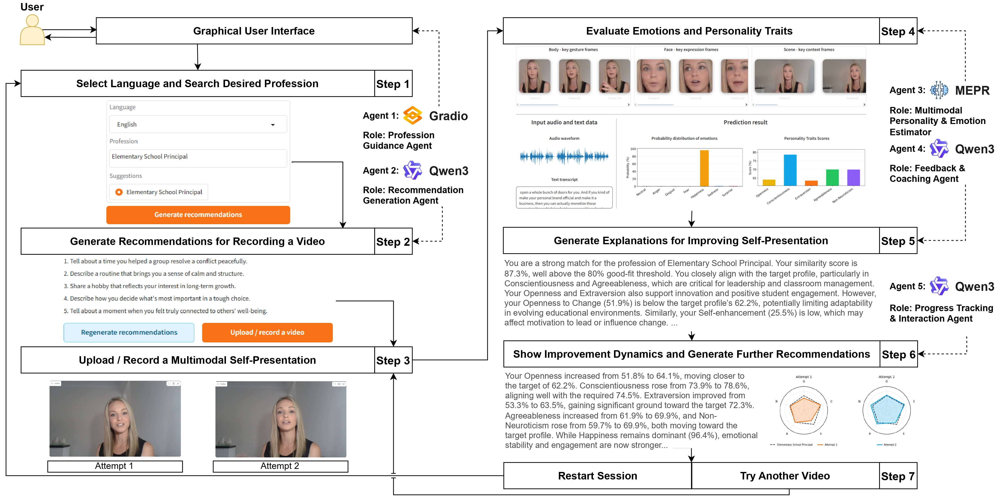

# CV-MAPS: An Interactive Multi-Agent System for Personality-Aware Multimodal Self-Presentation Coaching

This repository contains the demo system described in the AAMAS 2026 paper
"CV-MAPS: An Interactive Multi-Agent System for Personality-Aware Multimodal
Self-Presentation Coaching".

## Abstract
This demo introduces CV-MAPS, an interactive multi-agent system for
personality-aware multimodal self-presentation coaching. The system guides
users through recording short multimodal CVs, which are analyzed by a neural
network to estimate emotions and personality traits from face, body, voice,
scene, and transcribed speech. CV-MAPS leverages off-the-shelf Large Language
Models (LLMs) to generate personalized, actionable feedback on speech content,
emotional regulation, nonverbal, and para-linguistic presentation. Users can
iteratively and interactively refine their multimodal self-presentations, while
the system tracks progress and suggests alternative professions when alignment
with the target profile remains low. By closing the loop between multimodal
expression, AI analysis, and coaching, CV-MAPS enables data-driven profession
exploration through authentic self-presentation.

Demo video: https://youtu.be/Z41Hpe_OROQ

## System Overview
CV-MAPS implements a closed-loop process with five coordinated agents:
- Profession Guidance Agent: manages UI and session flow.
- Recommendation Generation Agent: drafts interview questions for the target
  profession.
- Multimodal Personality and Emotion Estimator: analyzes face, body, scene,
  audio, and text.
- Feedback and Coaching Agent: interprets analysis and provides actionable
  advice.
- Progress Tracking Agent: compares attempts, visualizes dynamics, and suggests
  alternative roles.



## How It Works
1) Select language and target profession.
2) Generate interview questions.
3) Record or upload a video response.
4) Run multimodal analysis (emotion + Big Five traits).
5) Receive personalized feedback and suggested improvements.
6) Record additional attempts and track progress toward the target profile.

## Project Structure (high level)
- `app/` UI and orchestration logic
- `core/` models, inference, attribution, metrics
- `data/` profession trait profiles
- `assets/` custom CSS
- `run.py` entrypoint

## Configuration
Runtime and UI settings live in `app/config.py` (e.g., thresholds, limits,
language defaults, and feature flags). Adjusting this file lets you tune the
demo without changing the core logic.

## Setup
1) Create and activate a virtual environment.
2) Install dependencies:
   ```bash
   pip install -r requirements.txt
   ```
3) Ensure `ffmpeg` is available in your PATH (used for video conversion).

Notes:
- GPU is recommended. The demo auto-selects CUDA if available.
- The first LLM run will download the Qwen model into the local cache.

## Run
```bash
python run.py
```
Open http://0.0.0.0:7860 in a browser.
